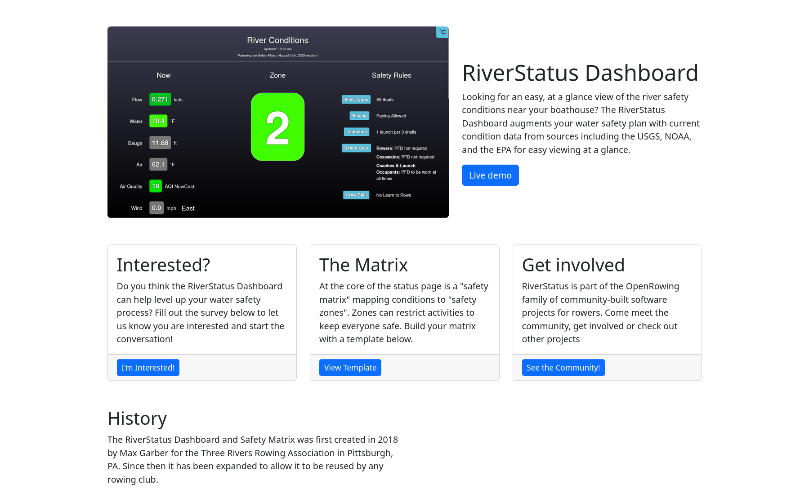

# RiverStatusDashboard Landing Page

This repository contains the source code for the landing page for the RiverStatusDashboard project.

## Preview

## Usage

Clone this repository and navigate into it. Run `npm install` and then run `npm start` which will open up a preview of the template in your default browser, watch for changes to core template files, and (attempt to) live reload the browser when changes are saved. You can view the `package.json` file to see which scripts are included.

The core files for the main content of the site are located in `src/pug` and use [pug syntax](https://pugjs.org/).

#### npm Scripts

* `npm run build` builds the project - this builds assets, HTML, JS, and CSS into `dist`
* `npm run build:assets` copies the files in the `src/assets/` directory into `dist`
* `npm run build:pug` compiles the Pug located in the `src/pug/` directory into `dist`
* `npm run build:scripts` brings the `src/js/scripts.js` file into `dist`
* `npm run build:scss` compiles the SCSS files located in the `src/scss/` directory into `dist`
* `npm run clean` deletes the `dist` directory to prepare for rebuilding the project
* `npm run start:debug` runs the project in debug mode
* `npm start` or `npm run start` runs the project, launches a live preview in your default browser, and watches for changes made to files in `src`

You must have npm installed in order to use this build environment.

## Bugs and Issues

Have a bug or an issue with this landing page? [Open a new issue](https://github.com/OpenRowingCommunity/RiverStatusLandingPage/issues) here on GitHub.

## Copyright and License
This website was built with the [Start Bootstrap - Small Business](https://startbootstrap.com/template/small-business/) template which is Copyright 2013-2023 Start Bootstrap LLC. Code released under the [MIT](https://github.com/StartBootstrap/startbootstrap-small-business/blob/master/LICENSE) license.

The RiverStatusBoard landing page is also licensed under the MIT license per the [`LICENSE`](./LICENSE) file.
